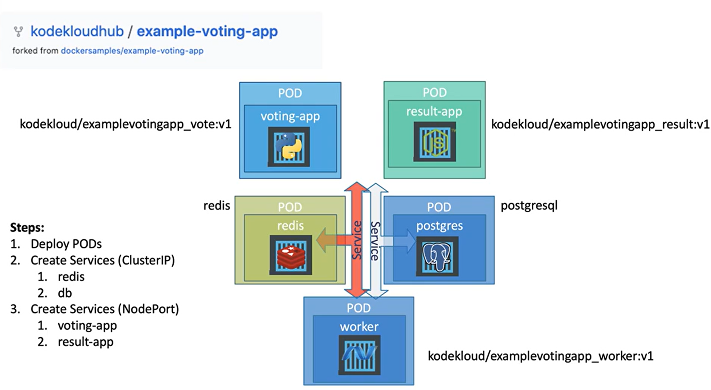
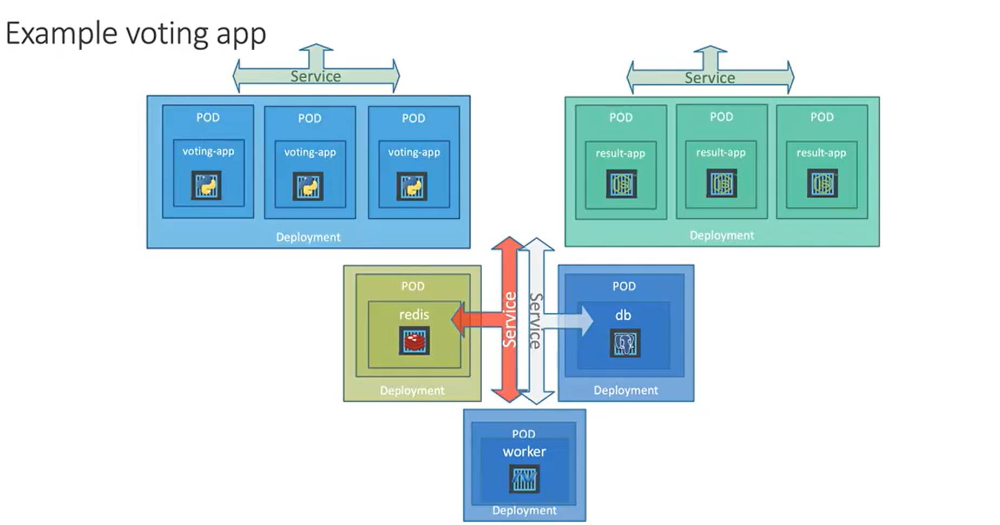

# Example Voting App - Kubernetes Deployment

This repository provides Kubernetes configuration files for deploying the Docker Example Voting App. The application architecture consists of multiple microservices that work together to provide a simple voting platform.

## Application Architecture



The voting application consists of five main components:

- **Voting App**: A Python web application that allows users to vote between two options
- **Result App**: A Node.js web application that displays the voting results
- **Worker**: A .NET worker service that processes votes
- **Redis**: A Redis queue that collects votes
- **PostgreSQL**: A PostgreSQL database that stores voting results

## Kubernetes Components



## Repository Structure

This repository offers two different approaches to deploy the application:

### PODs_Approach
Direct pod creation with associated services:
```
PODs_Approach/
├── postgres-pod.yaml
├── postgres-service.yaml
├── redis-pod.yaml
├── redis-service.yaml
├── result-app-pod.yaml
├── result-app-service.yaml
├── voting-app-pod.yaml
├── voting-app-service.yaml
└── worker-app-pod.yaml
```

### Deployment_Approach
Deployment-based approach with services for better scaling and management:
```
Deployment_Approach/
├── postgres-deploy.yaml
├── postgres-service.yaml
├── redis-deploy.yaml
├── redis-service.yaml
├── result-app-deploy.yaml
├── result-app-service.yaml
├── voting-app-deploy.yaml
├── voting-app-service.yaml
└── worker-app-deploy.yaml
```

## Deployment Steps

1. Deploy Pods/Deployments
2. Create Services
   - Database services (Redis, PostgreSQL) using ClusterIP
   - Frontend services (voting-app, result-app) using NodePort

## Getting Started

### Prerequisites
- Kubernetes cluster (minikube or cloud provider)
- kubectl CLI tool

### Deploy using PODs approach
```bash
# Deploy pods
kubectl create -f PODs_Approach/postgres-pod.yaml
kubectl create -f PODs_Approach/redis-pod.yaml 
kubectl create -f PODs_Approach/voting-app-pod.yaml
kubectl create -f PODs_Approach/result-app-pod.yaml
kubectl create -f PODs_Approach/worker-app-pod.yaml

# Deploy services
kubectl create -f PODs_Approach/postgres-service.yaml
kubectl create -f PODs_Approach/redis-service.yaml
kubectl create -f PODs_Approach/voting-app-service.yaml
kubectl create -f PODs_Approach/result-app-service.yaml
```

### Deploy using Deployments approach
```bash
# Create deployments
kubectl apply -f Deployment_Approach/postgres-deploy.yaml
kubectl apply -f Deployment_Approach/redis-deploy.yaml
kubectl apply -f Deployment_Approach/voting-app-deploy.yaml
kubectl apply -f Deployment_Approach/result-app-deploy.yaml
kubectl apply -f Deployment_Approach/worker-app-deploy.yaml

# Create services
kubectl apply -f Deployment_Approach/postgres-service.yaml
kubectl apply -f Deployment_Approach/redis-service.yaml
kubectl apply -f Deployment_Approach/voting-app-service.yaml
kubectl apply -f Deployment_Approach/result-app-service.yaml
```

## Accessing the Application

Once deployed, the applications can be accessed via:

### Using NodePort
- Voting App: `http://<node-ip>:30004`
- Result App: `http://<node-ip>:30005`

To get the IP:
```bash
# Get service ports
kubectl get svc
```

### Using Minikube
For minikube users, you can easily access the services with:
```bash
# Get the voting app URL
minikube service voting-app-service --url

# Get the result app URL
minikube service result-app-service --url
```

These commands will output a URL that you can open in your browser to access the applications directly.

## Verifying Deployment
To verify all components are running correctly:
```bash
# Check pods
kubectl get pods

# Check services
kubectl get svc

# Check deployments (if using deployment approach)
kubectl get deployments
```

## Container Images

This project uses the following container images:
- Voting App: `kodekloud/examplevotingapp_vote:v1`
- Result App: `kodekloud/examplevotingapp_result:v1`
- Worker: `dockersamples/examplevotingapp_worker`
- Redis: Standard Redis image
- PostgreSQL: Standard PostgreSQL image

## Original Source
This project is forked from `dockersamples/example-voting-app` and adapted for Kubernetes deployment learning.
